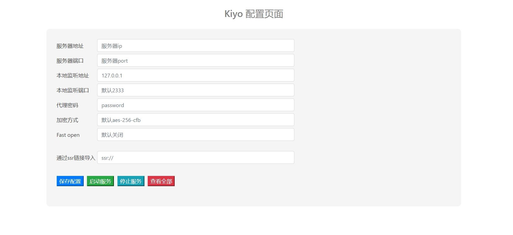

# kiyoss
simple ss&amp;ssr webUI

这是一个具有webUI操作页面的shadowsocks面板

## 支持

- shadowsocks服务端和客户端部署
- shadowsocksr服务端和客户端部署

## 预览



## 使用

```bash
wget https://github.com/Landers1037/kiyoss/releases/download/1.0/kiyo.zip
```

Linux版本

```bash
wget https://github.com/Landers1037/kiyoss/releases/download/1.0/kiyo
```

### 命令

```bash
info 查看kiyo的介绍
server 搭建ss服务端
ss 搭建本地ss客户端
ssr 搭建本地ssr客户端
stop 停止服务（仅支持linux）
version 查看版本信息
web 启动web界面
```

### 开始

```bash
./kiyo web
```

## 配置文件

- ss使用目录下的`local.json`文件
- ssr使用目录下的`ssr.json`文件
- server服务端使用`server.json`文件

当你不会配置这些文件时，可以使用webUI手动配置

详细文档参考 [mgek kiyo](http://mgek.cc/kiyo.md)